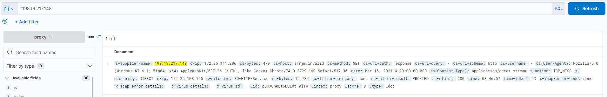

# Task 2

For task 2, we are given a subnet, a network proxy log, and login data from a domain controller.  Our task is to identify the logon ID of the user session that communicated with the malicious LP.  A further hint is given that the user we are looking for should have been on a machine that sent a beacon, and was active at the time the beacon was sent.

Our subnet is `172.26.12.128/26`.  An initial glance, both `logins.json` and `proxy.log` have a considerable amount of data we will need to sift through.  To help with this process, we can utilize [Elasticsearch and Kibana](https://www.elastic.co/guide/en/kibana/current/docker.html) which is fairly trivial to spin up in docker.

Once Kibana is up and running, select `Add Data`, and `Upload file`.  We will start by uploading `proxy.log` for analysis.  First, let's modify `proxy.log` so we can smoothly ingest.  Open up `proxy.log` in your favorite editor and delete the first couple commented lines:

```
#Spftware: SGOS 6.7.5.3
#Version: 1.0
#Date: 2021-04-16 13:07:22 EST (UTC-0400)
```

Additionally, remove `#Fields` from the next line:

```
#Fields: date time time-taken c-ip...
```

So that it reads:

```
date time time-taken c-ip...
```

Now, back in Kibana, go ahead and upload the modified file, and in the `Summary` block, select `Override settings.  Modify the settings so that they match the below:
 


This will properly assign column names to the data to make our analysis a bit easier.  Apply the settings, and select Override settings one more time.  This time, select `time` as the approriate Time field to ensure our times are accurately reflected.  Apply the settings once more and then go ahead and import the data with an index name of `proxy`.

Let's start exploring our data.  In the `Discover` window, let's search for the LP IP we derived from Task 1:



Here we can see we get one result back.  This must be our beacon.  Take note oof the timestamp and `s-ip` - looks like this beacon occured on `March 16, 2021 08:46:57` from `172.25.111.206` (NOTE: for some reason, Kibana is displaying the date as a day prior to the real date, but expanding the JSON object shows the true date).  Let's take a look at `logins.json` now.

Upload `logins.json` into Kibana.  It should be fine accepting the defaults for this dataset.  Name the index `logins` and then proceed back to `Discover`.  Select your `logins` index from the dropdown and enter `MapDescription: "Successful logon" and 172.25.111.206` in the search bar.  This will search for all successful logon events from the system that sent the beacon.  Since we know the timestamp when the beacon occurred, let's further restrict our results to before the beacon.  From the time dropdown, select a time range that encompasses up to the beacon time we noted earlier.  Ensure the results are sorted by time ascending:


Our top result shows that the user `naquin.kenny` logged in at `08:28:08`.  Submitting the `TargetLogonId` of `0x34798A` successfully completes this task.

